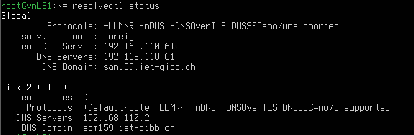
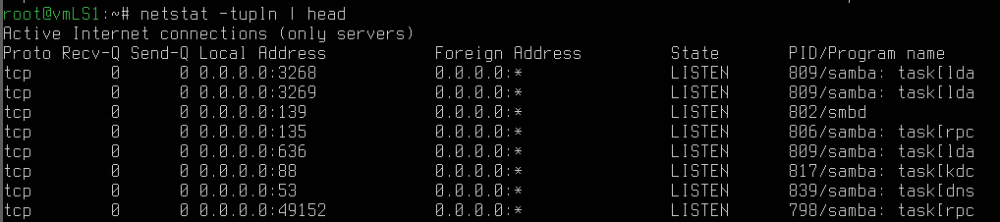

# AB01

## Vorbereitung DC/KDC

| Vorliegende IPs|              |
|-------------------------------|
| IP             | Name         |
|:---------------|:-------------|
| 192.168.110.61 | vmLS1        |
| 192.168.110.62 | vmLS2        |
| 192.168.110.30 | vmLP1        |
| 192.168.110.10 | vmWP1        |
| 192.168.110.2  | Gateway, DNS |
> search domain: sam159.iet-gibb.ch

## Samda DC Installieren, vmLS1

### Konfigurationsdateien vorbereiten

Wir ändern des Inhalt von `/ect/netplan/00-eth0.yaml` wie folgt:

```yaml
network :
    ethernets :
        eth0 : 
            addresses :
            - 192.168.110.61/24
            nameservers :
                addresses :
                - 192.168.110.2
                search :
                - sam159.iet-gibb.ch
            routes :
            - to : default
                via : 192.168.110.2
    version : 2
```

Sobald dies gemacht ist, muss folgendes in `/etc/hosts` eingefügt werden:

```txt
127.0.0.1       localhost.localdomain       localhost
127.0.1.1       vmLS1.sam159.iet-gibb.ch    vmLS1
192.168.110.61  vmLS1.sam159.iet-gibb.ch    vmLS1

# The following lines are desirable for IPv6 capable hosts
::1             ip6-localhost ip6-loopback
fe00 ::0        ip6-localnet
ff00 ::0        ip6-mcastprefix
ff02 ::1        ip6-allnodes
ff02 ::2        ip6-allrouters
```

Und zuletzt noch `/etc/hostname` um `vmLS1.sam159.iet-gibb.ch` ergänzt werden.

### App und Dependencies installieren

```bash
apt update && apt upgrade
snap refresh
reboot
apt install samba smbclient heimdal-clients
# Kerberos-Realm: SAM159.IET-GIBB.CH
# Kerberos-/Admin-Server: vmLS1.sam159.iet-gibb.ch
apt install acl attr build-essential libacl1-dev libattr1-dev libblkid-dev libgnutls28-dev libreadline-dev python2-dev python2 python-dev-is-python3 python3-dnspython gdb pkg-config libpopt-dev libldap2-dev libbsd-dev attr krb5-user docbook-xsl libcups2-dev acl ntp ntpdate net-tools git winbind libpam0g-dev dnsutils lsof
```

### Setup Samba

Zu Beginn erstellen wir ein Backup des originalen Sambe-conf-File. Hierzu benutzen wir `mv /etc/samba/smb.conf /etc/samba/smb.conf.original`. Dies dient dazu, dass Samba nicht als Fileserver startet. Von hier aus können wir nun die Einrichtung des Samba-KDC mit `samba-tool domain provision` beginnen. Es müssen folgende Angaben genutzt werden:

- Realm: SAM159.IET-GIBB.CH
- Domain: SAM159
- Server Role: dc
- DNS backend: SAMBA_INTERNAL
- DNS forwarder IP: 8.8.8.8
- Admin Password: Sml12345**

Mit diesem Schritt wird auch der DNS-Dienst von Samba aufgestartet, weshalb wir den DNS-Resolver mit `sudo systemctl disable systemd-resolved && sudo systemctl stop systemd-resolved && rm /etc/resolv.conf` deaktivieren. Stellvertretend hierzu wird nun das File `/etc/resolv.conf` wie folgt ersetzt:

```txt
nameserver 192.168.110.61
search sam159.iet-gibb.ch
```

Des Inhalt von `/etc/samba/smb.conf` sollte wie folgt aussehen:

```txt
#  Global parameters
[ global ]
    dns forwarder = 8.8.8.8
    netbios name = VMLS1
    realm = SAM159.IET-GIBB.CH
    server role = active directory domain controller
    workgroup = SAM159
[ sysvol ]
    path = /var/lib/samba/sysvol
    read only = No
[ netlogon ]
    path = /var/lib/samba/sysvol/sam159.iet-gibb.ch/scripts
    read only = No

```

Weiter müssen wir nun Samba in den Systemboot einfügen. Dies wird mit folgenden Befehlen erreicht:

```bash
systemctl unmask samba-ad-dc
systemctl enable samba-ad-dc
systemctl start samba-ad-dc
# Mit den folgenden Schritten wird getestet, ob alles geklappt hat
reboot
systemctl status samda-ad-dc
```

Nun konfigurieren wir Samba für Kerberos, indem wir `/etc/krb5.conf` löschen und wie folgt neu erstellen:

```txt
[ libdefaults ]
    default_realm = SAM159.IET-GIBB.CH
    fcc-mit-ticketflags = true
[ realms ]
    SAM159.IET-GIBB.CH = {
        kdc = vmLS1.sam159.iet-gibb.ch
        admin_server = vmLS1.sam159.iet-gibb.ch
    }
[ domain_realm ]
    .sam159.iet-gibb.ch = SAM159.IET-GIBB.CH
    sam159.iet-gibb.ch = SAM159.IET-GIBB.CH
```

### Netzwerk testen

Im Folgenden werden wir das oben definierte Netzwerk testen:

```bash
systemctl enable systemd-resolved
systemctl start systemd-resolved
systemctl status systemd-resolved
resolvectl status
```

Beim letzen Command erhalten wir folgenden Output, welcher dem gewünschten Output entspricht:



Da wir die Tests abgeschlossen haben, können wir den Resolver-Dienst wieder ausschalten:

```bash
systemctl stop systemd-resolved
systemctl disable systemd-resolved
reboot
```

`netstat -tupln` zeigt auch die gewünschten Ports an:



Als weitere Check nutzen wir nun `samba_dnsupdate --verbose`, was fehlerfrei verlief.

Auch können wir dies mit dem `host` Command machen: 

```bash
host -t SRV _kerberos._tcp.sam159.iet-gibb.ch
host -t SRV _gc._tcp.sam159.iet-gibb.ch
host -t SRV _ldap._tcp.sam159.iet-gibb.ch
host -t A vmLS1.sam159.iet-gibb.ch
```

Die Outputs entsprechen jeweils den vorgegebenen Angaben (Siehe AB01-PDF).

### Reverse-Lookup-Zone einrichten

Wir richten die Reverse-Lookup-Zone mit `samba-tool dns zonecreate vmLS1 110.168.192.in-addr.arpa 61 PTR vmls1.sam159.iet-gibb.ch -Uadministrator` ein. Anschliessend muss die Zone noch eingetragen werden; dies wird mit `samba-tool dns add 192.168.110.61 110.168.192.in-addr.arpa 61 PTR vmls1.sam159.iet-gibb.ch
-Uadministrator` gemacht.

### A- und PTR-Records erfassen

- A-Record vmls2
    - samba-tool dns add vmLS1.sam159.iet-gibb.ch sam159.iet-gibb.ch vmLS2 A 192.168.110.62 -U administrator
- A-Record vmlp1
    - samba-tool dns add vmLS1.sam159.iet-gibb.ch sam159.iet-gibb.ch vmLP1 A 192.168.110.30 -U administrator
- PTR-Record in Reverse Zone für vmlp1
    - samba-tool dns add vmLS1.sam159.iet-gibb.ch 110.168.192.in-addr.arpa 30 PTR vmLP1.sam159.iet-gibb.ch -U administrator
- PTR-Record in Reverse Zone für vmls2
    - samba-tool dns add vmLS1.sam159.iet-gibb.ch 110.168.192.in-addr.arpa 30 PTR vmLS1.sam159.iet-gibb.ch -U administrator

Mit einem Ping auf die jeweiligen Clients kann dies nun getestet werden - die Pings sind alle erfolgreich gewesen.

## Aufgaben

### 4.1 - Portnummern

- 445
    - SMB ( Server Message Block). File Sharing Protocol, das meistens von Windows-basierten Geräten genutzt wird; z.B. für Drucker
- 389
    - LDAP
- 636
    - LDAP over SSL
- 88
    - Kerberos authentication protocol communication
- 53
    - DNS

### 4.2 - Lösen Sie ein Ticket für den User administrator

kinit administrator@SAM159.IET-GIBB.CH

### 4.3 - Verbindung testen mit

`smbclient -N --use-kerberos=required -L vmLS1`

### 4.4 Wie sieht der Credential Cache aus?

### 4.5 Warum funktioniert der Verbindungsaufbau mit localhost nicht?

`smbclient -N --use - kerberos = required -L localhost`

### 4.5 Passwortkomplexität deaktivieren mit samba-tool

```bash
samba - tool domain passwordsettings set -- complexity = off
samba - tool domain passwordsettings set -- history - length =0
samba - tool domain passwordsettings set --min - pwd - age =0
samba - tool domain passwordsettings set --max - pwd - age =0
samba - tool user setexpiry Administrator -- noexpiry
```