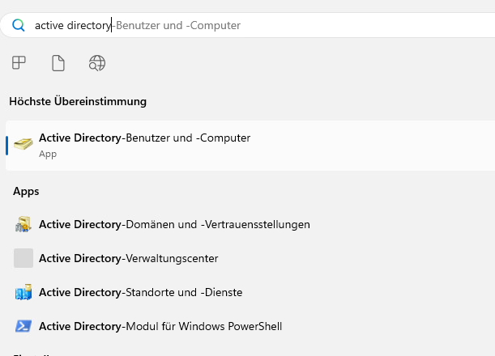
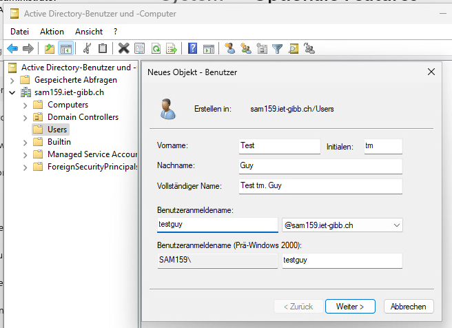
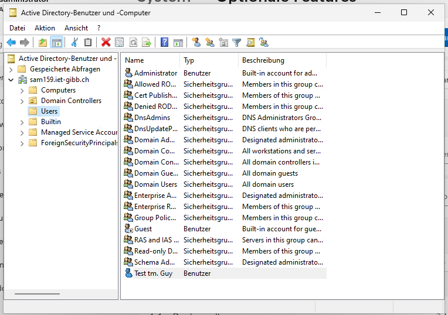
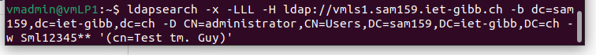
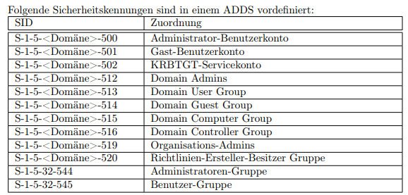

# AB02

## RSAT

RSAT steht für Remote Server Administration Tools. Diese Tools werden zur Verwaltung einer AD-Domäne genutzt. 

### 3.2, Aufgaben

#### Fügen Sie vmWP1 in die Domain sam159.iet-gibb.ch ein. Was müssen Sie beim Client netzwerkseitig unbedingt beachten, damit das klappt?

Windows Einstellungen > Konten > Arbeit und Schule > Neues Konto hinzufügen > AD

Bevor das klappt, muss jedoch noch folgendes konfiguriert werden: Unter Windows muss der DNS-Server zum AD-Server gewechselt werden, i.e. 192.169.110.61

#### Welche Domain-Admin Tools stehen ihnen jetzt auf vmWP1 zur Verfügung?



#### Legen Sie mit RSAT einen User an





#### Kontrollieren sie die DNS-Einträge auf dem DNS-Server mit RSAT-Tools. Alles ok?


#### Active Directory mit ldapsearch abfragen

Abfrage zum erstellten User:



``` txt
dn: CN=Test tm. Guy,CN=Users,DC=sam159,DC=iet-gibb,DC=ch
objectClass: top
objectClass: person
objectClass: organizationalPerson
objectClass: user
cn: Test tm. Guy
sn: Guy
givenName: Test
initials: tm
instanceType: 4
whenCreated: 20240304085911.0Z
whenChanged: 20240304085911.0Z
displayName: Test tm. Guy
uSNCreated: 4043
name: Test tm. Guy
objectGUID:: Ib6v1SsPmUqZhvUngxmqTw==
badPwdCount: 0
codePage: 0
countryCode: 0
badPasswordTime: 0
lastLogoff: 0
lastLogon: 0
primaryGroupID: 513
objectSid:: AQUAAAAAAAUVAAAAj8MPj00BVVDYj3OSUAQAAA==
accountExpires: 9223372036854775807
logonCount: 0
sAMAccountName: testguy
sAMAccountType: 805306368
userPrincipalName: testguy@sam159.iet-gibb.ch
objectCategory: CN=Person,CN=Schema,CN=Configuration,DC=sam159,DC=iet-gibb,DC=
 ch
pwdLastSet: 133540163515471800
userAccountControl: 66048
uSNChanged: 4046
distinguishedName: CN=Test tm. Guy,CN=Users,DC=sam159,DC=iet-gibb,DC=ch

# refldap://sam159.iet-gibb.ch/CN=Configuration,DC=sam159,DC=iet-gibb,DC=ch

# refldap://sam159.iet-gibb.ch/DC=DomainDnsZones,DC=sam159,DC=iet-gibb,DC=ch

# refldap://sam159.iet-gibb.ch/DC=ForestDnsZones,DC=sam159,DC=iet-gibb,DC=ch

```

## ID-Mapping

Linux und Windows verwernden unterschiedliche Arten zur ID-Zuweisung. Die im AD gespeicherten SIDs müssen auf irgendeine Art und Weise auf GIDs und UIDs umgesetzt werden. Hierzu dient der Dienst **Winbind**. Die Art, wie der Dienst diese Conversion vornehmen soll wird im `smb.conf` definiert - in unserem Falle ist das die `rid-Methode`.
Bei dieser Methode wird die RID eines AD-Users/Gruppe für das ID-Mapping verwendet. Die RID wird beim Anlegen des Users automatisch vergehen und ist daher immer eindeutig. Diese Methode erlaubt es somit, ein einheitliches Mapping herzustellen.

## SID, RID

SID: Der Security Identifiert gehört zu den sogenannten Security Principals einer Domäne. Die Security Principals erhalten mit der SID ihre Kennung. Die SID besteht aus zwei Teilen: Eindeutige Domänenkennung, eindeutige Objektkennung. Beispiele:

(1) 1-5-21-3770624505-2901393275-1935834510-500
(2) 1-5-21-3770624505-2901393275-1935834510-512

RID: Der Relative Identifier gibt die Geräteidentifikation an. In den oberen Beispielen wären das 500 und 512.



