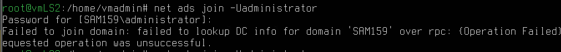
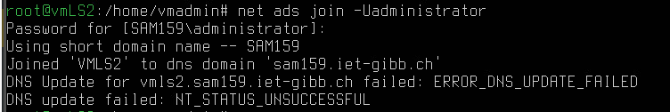
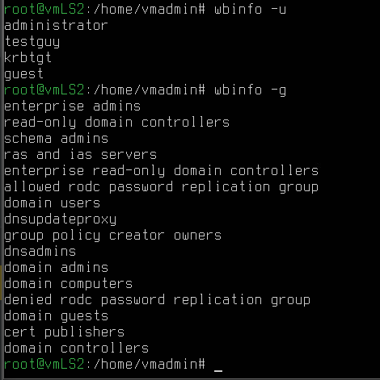
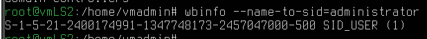
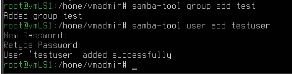
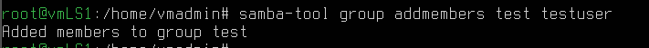

# Netzwerk konfigurieren

`/etc/netplan/00-eth0.yaml` muss wie folgt geändert werden:

```yaml 
network :
    version : 2
    renderer : networkd
    ethernets :
        eth0 :
            addresses : [ 192.168.110.62/24 ]
            dhcp4 : false
            routes :
              - to : default
                via : 192.168.110.2
            nameservers :
                addresses : [ 192.168.110.61 ]
                search : [ sam159 . iet - gibb . ch ]

```

Anschliessend wird Samba instaliert mit `apt install samba samba-common-bin smbclient heimdal-clients libpam-heimdal`. Auch wird `apt install libnss-winbind libpam-winbind` benötigt.

## Grundkonfiguration des Fileserver

```conf
[ global ]
    workgroup = sam159
    realm = SAM159 . IET - GIBB . CH
    security = ADS
    winbind enum users = yes
    winbind enum groups = yes
    winbind use default domain = yes
    winbind refresh tickets = yes
    template shell = / bin / bash
    idmap config * : range = 10000 - 19999
    idmap config SAM159 : backend = rid
    idmap config SAM159 : range = 1000000 - 1999999
    inherit acls = yes
    store dos attributes = yes
    client ipc signing = auto
    vfs objects = acl_xattr
```

- workgroup = sam159 Hier wird der NetBIOS-Name der Domäne angegeben. Auch als Mitglied im AD heisst der Parameter workgroup.

- realm = SAM159.IET-GIBB.CH Bei dem realm handelt es sich um die 
Information für die Kerberos-Domäne. Für diesen Realm wird sich der Samba-Server einen KDC suchen. Beim Key Distribution Center (KDC) handelt es sich um die Zentral Vergabestelle der Kerberos-Tickets für Authentifizierung.

- security = ADS Damit legen Sie fest, dass Ihr Server ein Mitglied in einer AD-Domäne ist.

- inbind enum users = yes Ohne diesen Parameter würden die Benutzer auf dem lokalen Linux-System nicht angezeigt, wenn Sie die Benutzer mit getent passwd abfragen. Nur einzelne Benutzer könnten über das Kommando getent passwd username abgefragt werden. In Domänen mit vielen Benutzern sollten Sie diesen Parameter immer auf der Standardeinstellung no belassen, da der
Aufwand der Umrechnung des RIDs auf die IDs sehr aufwendig ist und das System stark belasten kann.

- winbind enum groups = yes Dieser Parameter hat die gleiche Aufgabe wie vorher schon der Parameter für die Benutzer. Auch hier gilt: In grösseren Umgebungen sollte der Wert dieses Parameters immer auf no gesetzt sein.

- winbind use default domain = yes Haben Sie nur eine Domäne, können Sie mit diesem Parameter dafür sorgen, dass nur die Benutzernamen von winbind übergeben werden, ohne die Domäne vor den Namen zu stellen. Wenn Sie aber Vertrauensstellungen zu anderen Domänen herstellen wollen, dürfen Sie diesen Parameter auf gar keinen Fall setzen.

- winbind refresh tickets = yes Mit diesem Parameter werden Kerberos-Tickets automatisch erneuert, wenn der Benutzer angemeldet ist und das Ticket abläuft.

- template shell = /bin/bash Diesen Parameter dürfen Sie auf gar keinen Fall vergessen. Ohne ihn kann sich ein Benutzer aus dem Active Directory zwar über ssh anmelden, aber er wird sofort wieder abgemeldet, da der Benutzer im Active Directory keine Shell zugewiesen bekommt, diese aber für eine erfolgreiche Anmeldung benötigt wird. Nur wenn Sie das rfc-2307-Schema verwenden und eine Shell bei den Benutzern eingetragen haben, können Sie diesen Parameter ignorieren. Setzen Sie diesen Parameter nicht, ist die Standardshell /bin/false; damit können Sie verhindern, dass sich ein Benutzer auf dem Server über ssh oder die lokale Konsole anmeldet.

-  idmap config * : range = 10000 - 19999 Neben den Gruppen und Benutzern, die Sie als Administrator anlegen, gibt es noch die Built-in-Groups. Diese Gruppen haben eine eigene verkürzte SID. Für diese Gruppen müssen Sie auch das ID-Mapping konfigurieren. Die Konfiguration der Built-in-Groups erfolgt über den Stern in idmap config * : range = 10000 - 19999. Eigentlich müssten Sie auch noch den Parameter idmap config * : backend = tdb konfigurieren, aber dieser Parameter wird von Samba4 automatisch gesetzt. Testen können Sie das mit dem Kommando testparm.

-  idmap config SAM159 : backend = rid Die IDs der Benutzer werden aus dem RID der AD-Benutzer generiert.

- idmap config SAM159 : = 1000000 - 1999999 Hier legen Sie den Bereich fest, in dem sich die UIDs der Benutzer befinden sollen

## vmLS2 als Mitglied der Domäne hinzufügen

Zunächst muss die VM gerebootet werden. Anschliessend wird `net ads join -Uadministrator` ausgeführt. Das Admin-PW soll `Sml12345**` sein.

Dies schlug fehlt - gemäss AB sollten die `krb5.conf` von vmLS1 und vmLS2 identisch sein, es fehlten jedoch die domain_realm-Einträge - diese wurden manuell nachgetragen.



Der Fehler lag bei einem Typo im netplan > der DNS-Server wurde vorhin falsch eingetragen/nicht korrigiert.



## Überprüfen, ob der Computer ins AD übernommen wurde

`wbinfo -u` und `wbinfo -g`



SID kann ausgelesen werden mit `vbinfo --name-to-sid=administrator`



## Rechte an die Benutzer vergeben

Hierzu muss `/etc/nsswitch.conf` angepasst werden:

```conf
passwd:     compat systemd winbind
group:      compat systemd winbind
shadow:     compat winbind
```

Mit `getent passwd` und `getent` group können nun die gemappten Linux-User und -Gruppen angezeigt werden.

# Aufgabe 3.1

`su administrator` hat problemlos geklappt.

# Aufgabe 3.2 

Auf vmLS1 muss folgendes eingegeben werden:

```bash
samba-tool group add test
samba-tool user add testuser1
```



Benutzer zur Gruppe hinzufügen mit `samba-tool group addmembers test testuser1`

