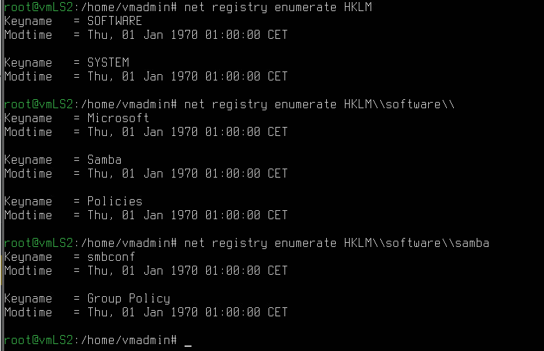
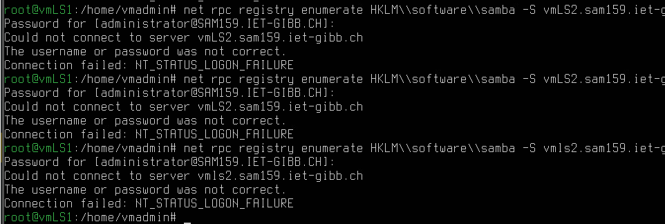
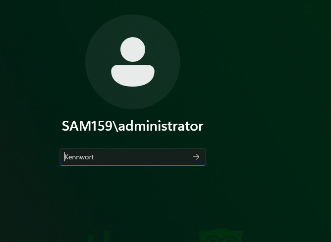
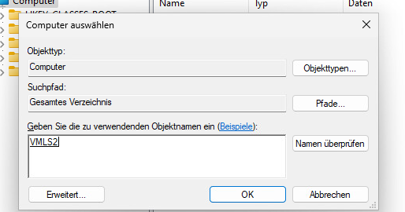
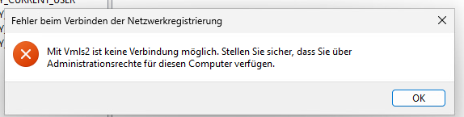
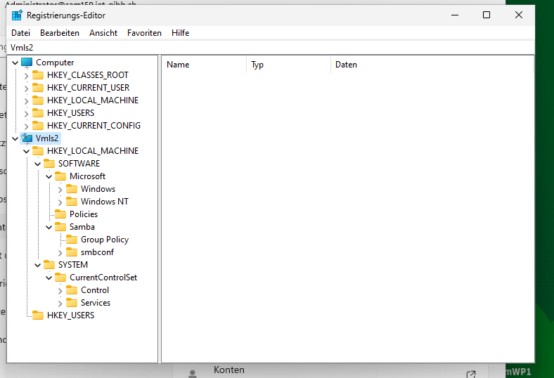

# AB04

## Verwaltung des Linux-Fileservers vmls2 über die Registry

Warum Fileserver über die Registry verwalten > Nachteile einer .conf:

- Jeder User zieht die smb.conf zu sich, wenn er mit dem Fileserver interagiert. Dadurch wird der Traffic start gehämmt, und auch ist die gleichzeitige Bearbeitung von Files nicht möglich. Weiter sind auch Kommentare in der .conf-File schädlich.

- Änderungen am Server müssen auf der lokalen smb.conf gemacht werden, anders als Änderungen über Regedit.

## Registry Datenbank

In der `smb.conf` muss noch `config backeng = registry` angefügt werden, damit wir mit dem Registry arbeiten können. Jedoch muss zuvor noch die Registry befüllt werden.

Der für Samba wichtige "Hive"/Registry-Eintrag ist `HKEY_LOCAL_MACHINE (HKLM)`. Beispiel von 3 Zugriffen:

```bash
net registry enumerate HKLM
net registry enumerate HKLM\\software\\
net registry enumerate HKLM\\software\\samba
```



Beim anzeigen des Samba-Schlüssels sieht man `smbconf`. Darunter wird später die gesamte Konfiguration des Fileservers abgelegt sein.

Weiter kann auch als ein anderer User darauf zugegriffen werden mit `net rpc registry enumerate HKLM\\software\\samba\\ -Uadministrator -I 192.168.220.11`. Alternativ kann auch über Kerberos mit einem `kinit administrator@SAM159.IET-GIBB.CH`, gefolgt von `net rpc registry enumerate HKLM\\software\\sambe -S vmLS2.iet-gibb.ch`. Leider habe ich hier Probleme mit dem Einloggen: 



Auch mit Windows kann hier nun verbunden werden. Hierzu melden wir uns auf dem Wndows Client als Domain-Admin an, und starten Regedit.



> Hier ging das Login mit demselben PW wie sonst überall problemlos..

Hier müssen wir uns zunächst über `Datei > Mit Netzwerkregistrierung verbinden` mit vmLS2 verbinden.



Leider kamen hier wieder Probleme auf, welche vermutlich mit den zuvor geschehenen Passwort-Probemen zusammenhängen:



## smb.conf in die Registry verschieben

Hierzu nutzen wir `net conf`. Spezifisch wird auf vmLS2 folgendes ausgeführt:

```bash
net conf import /etc/samba/smb.conf
net conf list
```

Mit `net conf list | less` können wir nun die gesamte .conf einsehen und "durchscrollen". Hier ist wichtig, dass bei Änderungen der Konfiguration und erneutem Import **alles überschrieben wird**. Somit ist es bei Änderungen in der Konfiguration nötig, die Datei immer als Ganzes neu einzuspielen, und nicht nur die angepassten Teile.

# Aufgabe 1

Die Verbindung zum Regedit wurde bereits bechrieben.



# Aufgabe 2

Hierzu wird mit `cp` eine Kopie/Backup erstellt. Anschliessend kann der gewünschte Eintrag nachgetragen werden.