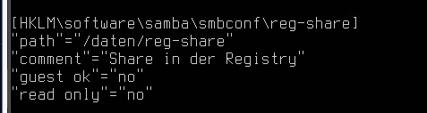
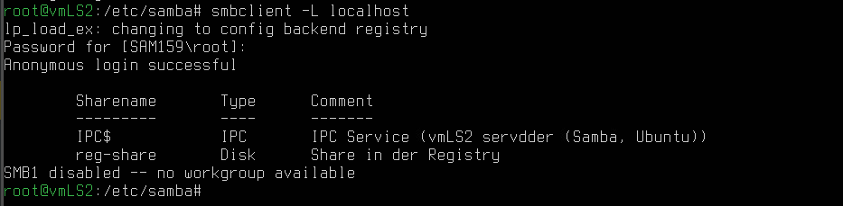
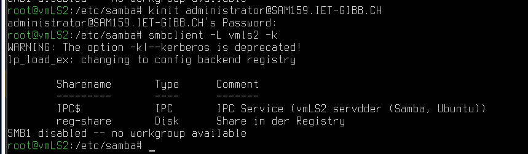

# AB05

## Share erstellen

Auf vmLS2:

```bash
mkdir p /date/reg-share
net conf addshare reg-share /daten/reg-share writeable=y guest_ok=n "Share in der Registry"
```

Teil vom Output von `net registry export hklm\\software\\samba /dev/stdout` zeigt den neuen Share:



Dies wäre auch von anderen Servern aus möglich, jedoch besteht weiterhin das Authentifizierungsproblem, welches in AB04 erwähnt wurde..

## Zugriff auf Share aus der Registry

`smbclient -L localhost` sollte vom Server aus anonymen Zugriff ermöglichen, und auch den Share auflisten:



Dies geht auch über Kerberos:



# Aufgabe 1 - Über Windows auf den Share verbinden

Im Windows muss der File Explorer geöffnet werden. Dort kann man sich dann über das Netzwerk verbinden, mit dem Connection String `\\vmLS2\reg-share`. Hier bekommt man nun Einblick in den Share. Files können nicht erstellt werden, da die Berechtigungen fehlen.

## Freigabe der Home-Verzeichnisse

